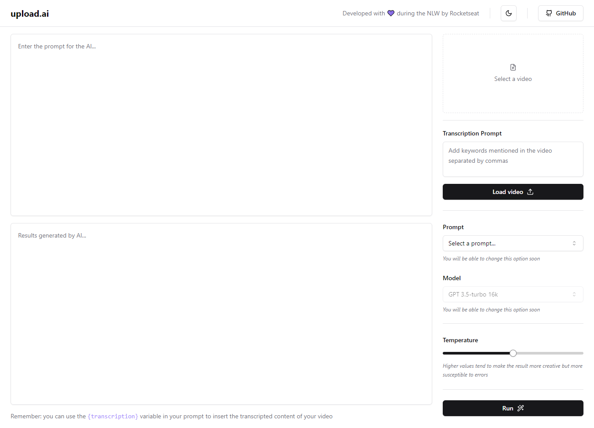
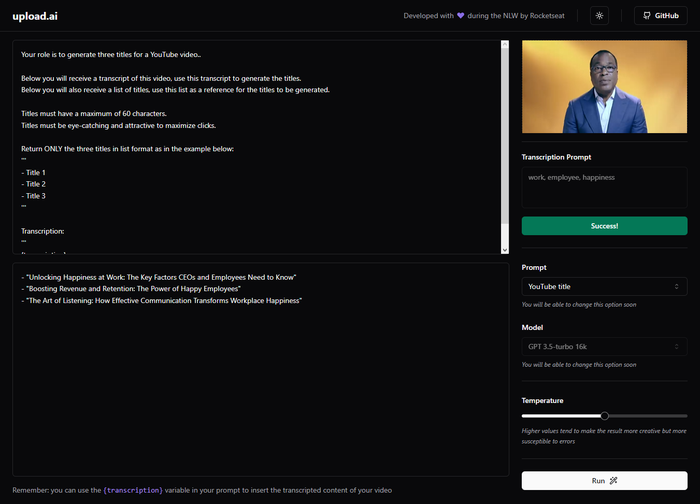

<h1 align="center">
  
upload.ai

  

    
    
    
    
  

</h1>

## ✨ Description

This application is integrated with the OpenAI API to generate the transcription of a video, then generate titles and descriptions to post it on YouTube!

Developed with 💜 during the NLW by Rocketseat.

## 🚀 Technologies
-  React
-  Next.js 13
-  OpenAI API
-  TypeScript
-  Tailwind CSS
-  Node.js
-  Fastify
-  Prisma
-  ffmpeg
-  zod

## 💻 Installation

After cloning/downloading this repository, in the `api` directory you'll need to add a `.env` file with a `DATABASE_URL` and a `OPENAI_API_KEY`.
Then open a terminal in the `api` directory and another on the `web` directory, then proceed to run:

-  `npm install` - To install packages dependencies
-  `npm run dev` - To run the application on your localhost

## 🌟 Preview

